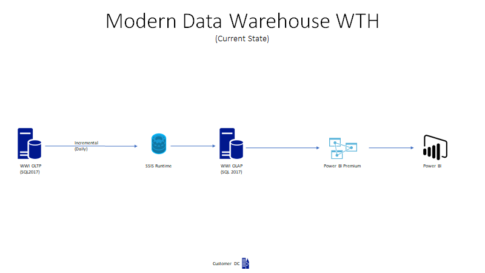

# Challenge 00 - <Title of Challenge> - Coach's Guide 

**[Home](./README.md)** - [Next Solution >](./Solution-01.md)

## Notes & Guidance

### Setup your Development Environment on your Laptop

For your local PC, ensure the following tools are installed.
1. [SQL Server Management Studion (Version 18.x or higher)](https://docs.microsoft.com/en-us/sql/ssms/download-sql-server-management-studio-ssms?view=sql-server-ver15)
2. [Visual Studio Code](https://code.visualstudio.com/Download) 
3. [Power BI Desktop](https://www.microsoft.com/en-us/download/details.aspx?id=58494)

### Setup Azure Tenant with Services for What the Hack

WWI runs their existing database platforms on-premise with SQL Server 2017.  There are two databases samples for WWI.  The first one is for their Line of Business application (OLTP) and the second is for their data warehouse (OLAP).  You will need to setup both environments as our starting point in the migration.

1. Open your browser and login to your Azure Tenant.  We plan to setup the Azure Services required for the What the Hack (WTH).  In your portal, open the [Azure Cloud Shell](https://docs.microsoft.com/en-us/azure/cloud-shell/overview)

2. Go into the cloud shell and select the subscription you plan to use for this WTH.

```
az account set --subscription {"Subscription Name"}
az account show
```

3. Create a resource group to store the Modern Data Warehouse What the Hack.  This will be the services for your source systems/environments.  In Cloudshell, run this command

```
az group create --location eastus2 --name {"Resource Group Name"}
```

4. In the Cloudshell, run this command to create a SQL Server instance and restore the databases.  This will create an Azure Container Instance and restore the WideWorldImporters and WideWorldImoprtersDW databases.  These two databases are your LOB databases for this hack.

```
az container create -g {Resource Group Name} --name mdwhackdb --image alexk002/sqlserver2019_demo:1  --cpu 2 --memory 7 --ports 1433 --ip-address Public
```

5. At the start of Challenge 1, reach out to your coach and they will share username and password for the LOB databases for this hack.

6. [Upload](https://docs.microsoft.com/en-us/azure/cloud-shell/persisting-shell-storage#upload-files) your ARM templates into Azure CloudShell. 


    /Student/Challenges/Challenge0/ARM.  
    The files are parametersFile.json and template.json.
    Edit the parmeters file and replace any {} with information requested.  


7. Run the last command to setup Azure Data Factory, Azure SQL Server Instance and SSIS Runtime.  This will build out for Challenge 1 the SSIS environment in Azure Data Factory.

```
az deployment group create --name final --resource-group {ENTER RESOURCE GROUP NAME} --template-file template.json --parameters parametersFile.json
```

8. Last step is to start your Azure Data Factory SSIS Runtime Service.  Go to [Connection pane](https://docs.microsoft.com/en-us/azure/data-factory/tutorial-deploy-ssis-packages-azure#connections-pane) in your Azure Data Factory service.  The startup time is approximately 5 minutes.


9. Review the database catalog on the data warehouse for familiarity of the schema [Reference document](https://docs.microsoft.com/en-us/sql/samples/wide-world-importers-dw-database-catalog?view=sql-server-ver15)


10. Review ETL workflow to understand the data flow and architecture [Reference document](https://docs.microsoft.com/en-us/sql/samples/wide-world-importers-perform-etl?view=sql-server-ver15)

